# Visual changelog

Before/after screenshots of visible changes to [reportsthatmatter.org](https://reportsthatmatter.org),
kept here instead of the main [`reportsthatmatter/reportsthatmatter`](https://github.com/reportsthatmatter/reportsthatmatter)
repo so images don't bloat its history. The record for a future "how RTM got
built" write-up.

**Convention:** one entry per batch of related work, not one per screenshot —
group what belongs together the way a single PR usually does. Context first
(what was broken or missing, one line on the fix), then the images,
captioned. Include the PR/issue number so this stays traceable back to the
actual diff and reasoning. Chronological, newest at the bottom — this is a
log, not a curated highlight reel; misses (a bug in an early attempt, a
design that didn't work) belong here too.

---

## 2026-08-09 — Contents-page hierarchy, sidenote/footer overlap, sidenote length clamp

### Contents-page hierarchy ([reportsthatmatter#81](https://github.com/reportsthatmatter/reportsthatmatter/pull/81))

The contents page rendered every section — top-level parts and their
subsections alike — as one flat list. Root cause: the section splitter
already knew whether a heading was h2 or h3, it just never got threaded
through to the template. Fixed by adding a `level` field and indenting
subsections under their part.

**Before** — no way to tell "Mr. Trump's Fraudulent Elector Plan" is a
subsection of "The Results of the Investigation":

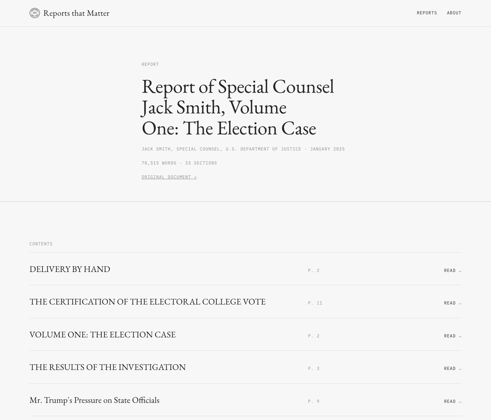

**After** — indented, de-emphasised, reads as a hierarchy:

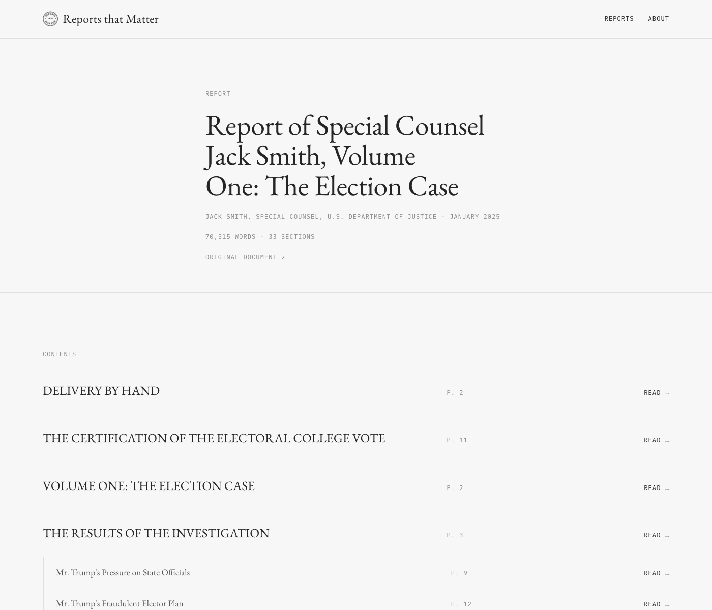

**Mobile** — same treatment holds at narrow widths:

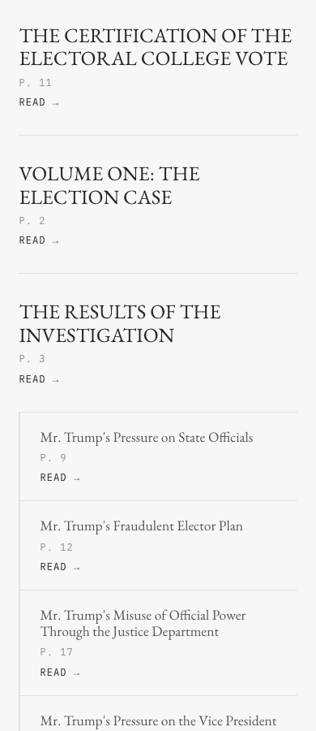

### Sidenote/footer overlap ([reportsthatmatter#81](https://github.com/reportsthatmatter/reportsthatmatter/pull/81))

Reported live on `/reports/jack-smith-vol1/mr-trumps-fraudulent-elector-plan`:
a long citation-heavy footnote overlapped the section nav and site footer.
Root cause, confirmed by measuring the DOM rather than guessing: `.sidenote`
floats right inside `.prose`, and `.prose` never cleared its floats — its
box ended ~2000px short of where the sidenote actually finished, and the
nav/footer that follow in the DOM rendered on top of it.

**Before** — nav row and footer text overlapping the still-rendering
sidenote:

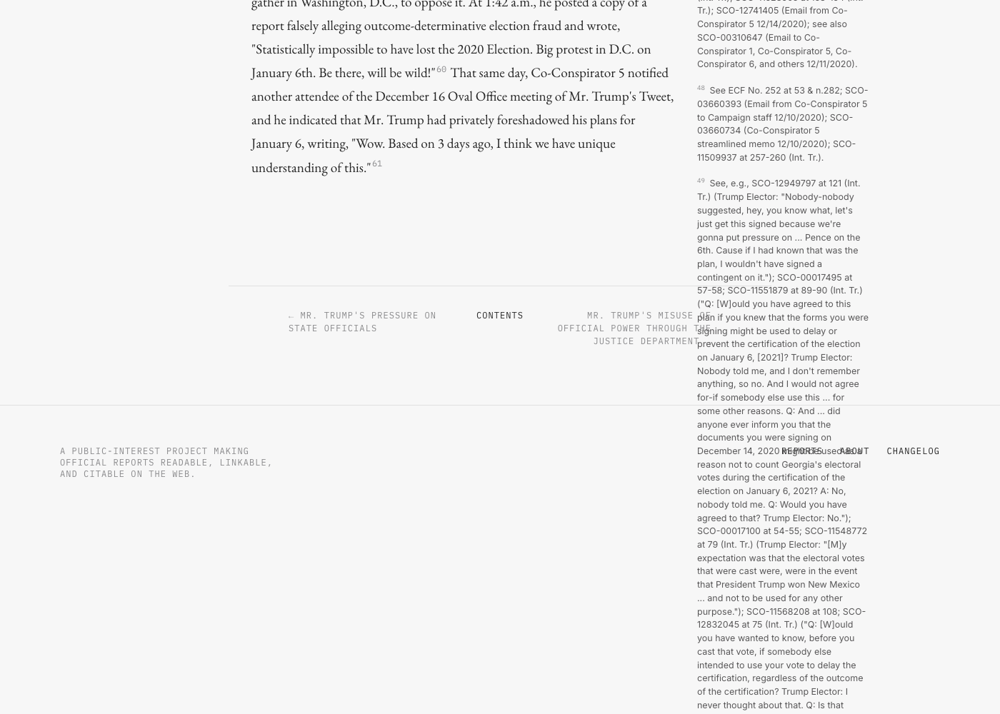

**After** — `display: flow-root` on `.prose`; nav and footer correctly
render below the note:

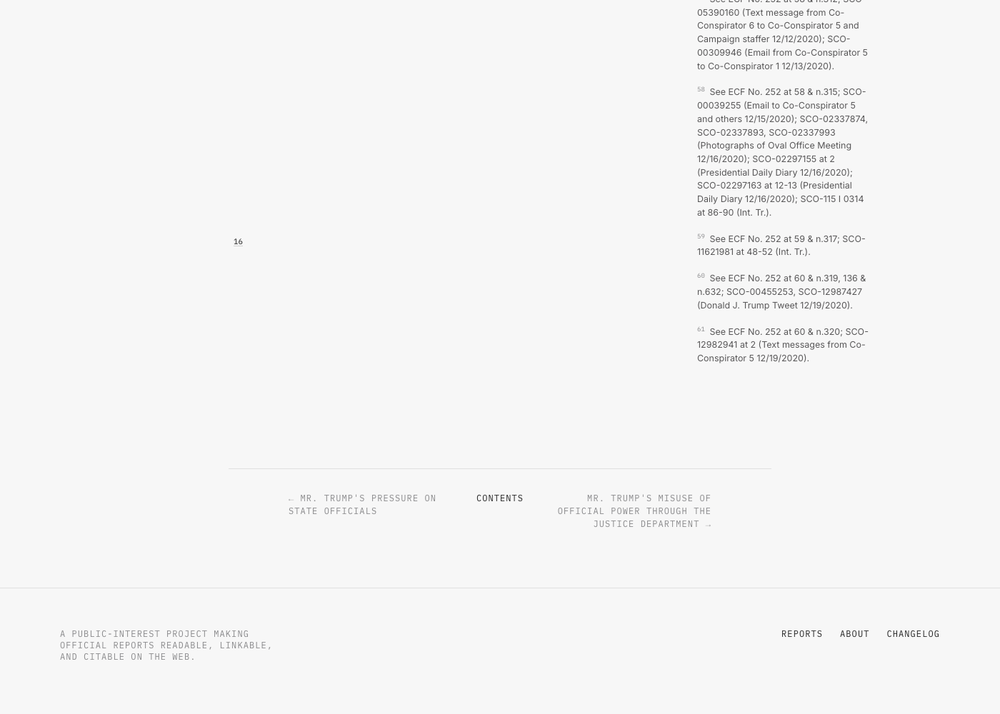

### Sidenote length clamp ([reportsthatmatter#80](https://github.com/reportsthatmatter/reportsthatmatter/issues/80), [reportsthatmatter#82](https://github.com/reportsthatmatter/reportsthatmatter/pull/82))

The deeper problem behind the overlap above: a note much taller than its
paragraph drags every note after it out of alignment, since floats stack
top-to-bottom in the margin column independent of each note's own anchor.
Researched before building — prior art (Tufte CSS, Gwern.net's
`sidenotes.js`, native popover + anchor positioning) and real note-length
data in
[`docs/plans/2026-08-09-sidenote-design-research.md`](https://github.com/reportsthatmatter/reportsthatmatter/blob/main/docs/plans/2026-08-09-sidenote-design-research.md).
Landed on: clamp a note over 400 characters (the genuine outliers, chiefly
Jack Smith's citation blocks) to ~8 lines with a fade and a "Show full note"
toggle.

**Attempt 1 — a bug, shipped nowhere, caught by screenshotting rather than
trusting the CSS on paper.** Used `mask-image` on the whole note to fade the
truncated tail. That also faded the toggle label, since it's a child of the
masked element — label text and note text both went semi-transparent and
overlapped into an illegible mess:

**Attempt 2 — fixed.** Swapped the mask for a solid gradient overlay
(`::after`, fading to the canvas colour) so the label sits on an opaque
background instead of fading with the text:

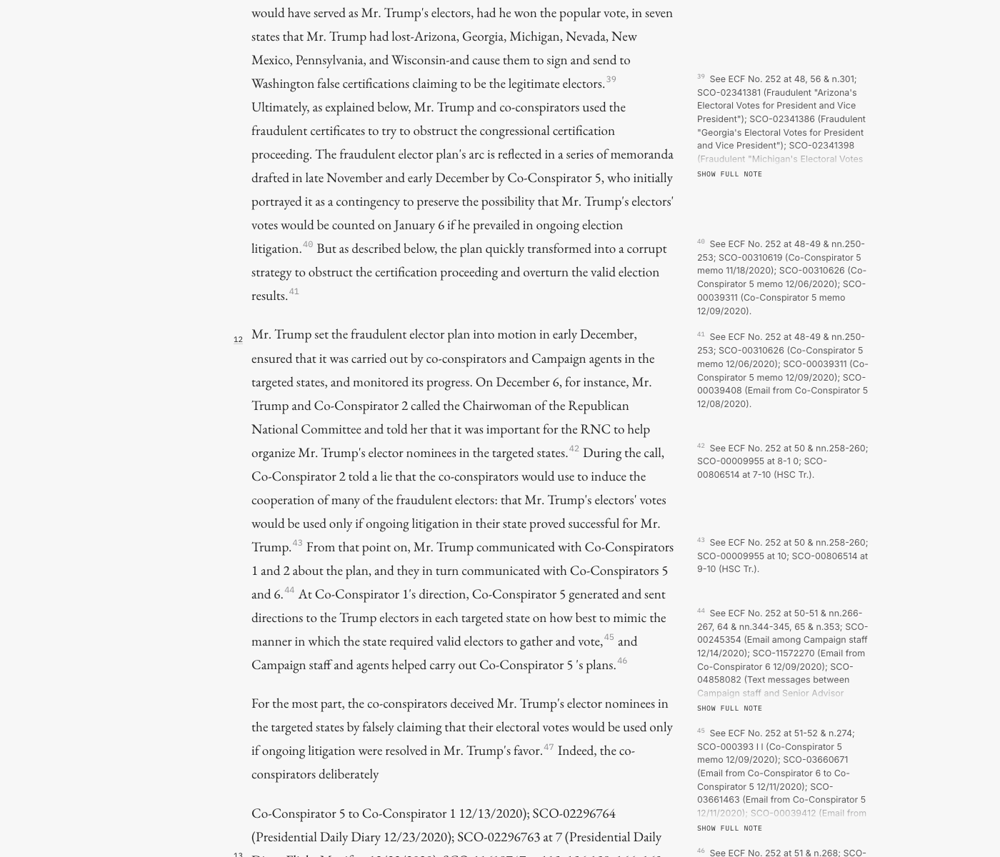

**Expanded** — clicking "Show full note" reveals the rest in place, using
the same checkbox the site already ships for mobile collapse:

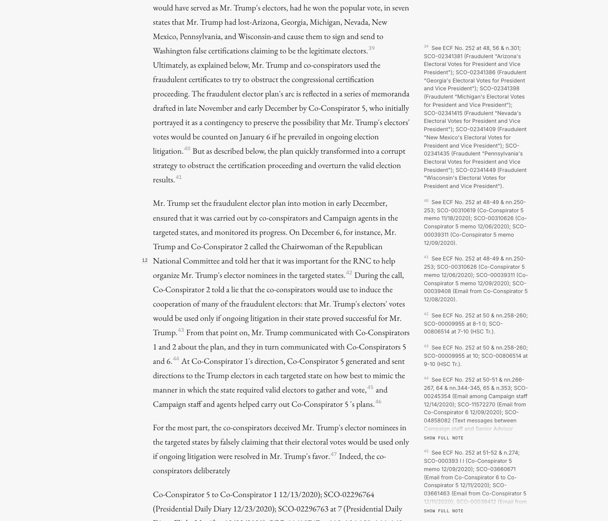

**Density check** — PSI's table-of-contents area, where many long notes
cluster together, holds up:

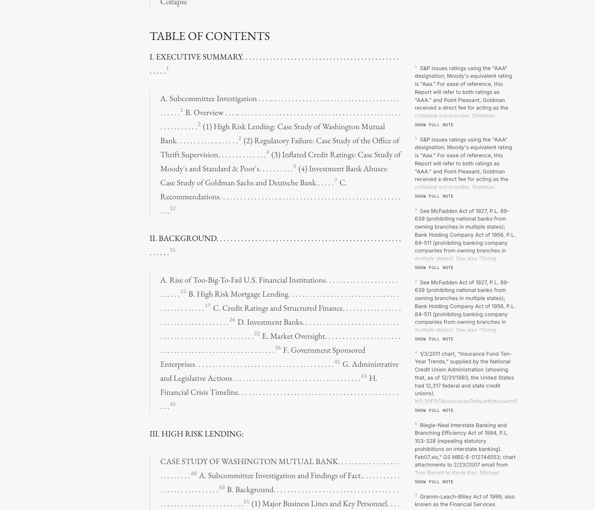

**Live**, on `reportsthatmatter.org/reports/jack-smith-vol1/mr-trumps-fraudulent-elector-plan`,
post-deploy:

---

## 2026-08-28 — Highlights, social proof, and search (retroactive)

Backfilling: these three features shipped between 2026-08-20 and 2026-08-22
with no screenshots logged here at the time. Captured against a local build
afterward, not at ship time — the underlying feature and output are exactly
what's live in production, only the capture is after the fact.

### Highlight-to-share and quote anchors ([reportsthatmatter#94](https://github.com/reportsthatmatter/reportsthatmatter/issues/94), [reportsthatmatter#95](https://github.com/reportsthatmatter/reportsthatmatter/issues/95))

Selecting part of a paragraph opens a popover to copy a link, copy the quote,
or save the highlight. The link names the words themselves, not just the
paragraph:

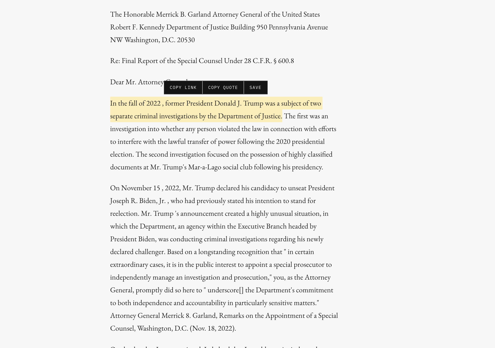

Following that link marks exactly the quoted words, nothing more:

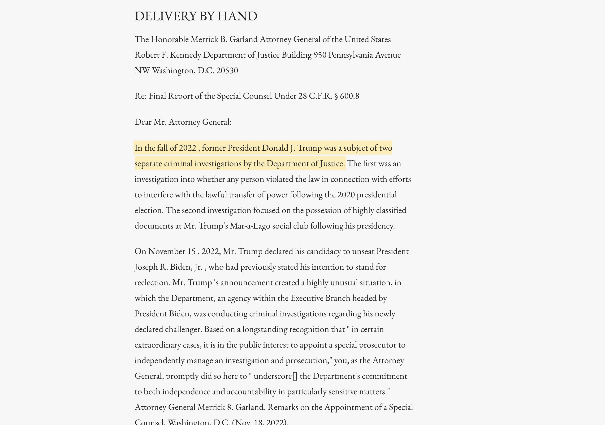

Saved highlights are kept in the browser (never sent anywhere) and listed at
`/highlights`, with the quote, source, and an export:

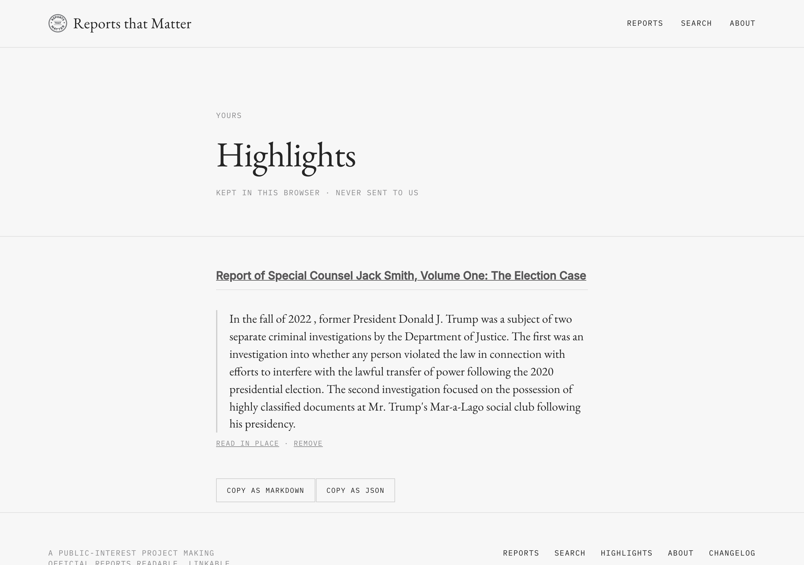

### Social proof ([reportsthatmatter#96](https://github.com/reportsthatmatter/reportsthatmatter/issues/96))

What other readers marked, shown the same way any highlight is shown — a
wash, not an underline or a printed count — with intensity scaled by how
many readers marked it. Six readers:

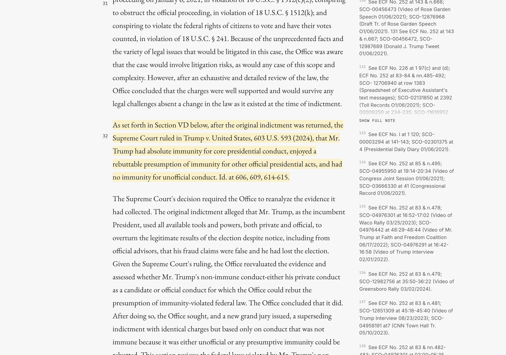

One reader, faint by comparison:

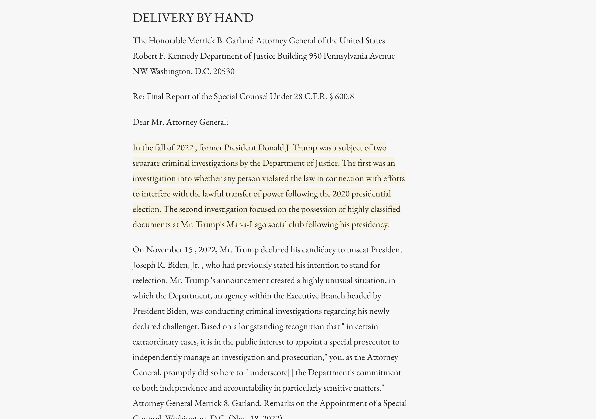

The same data surfaces on the report's contents page, ranked:

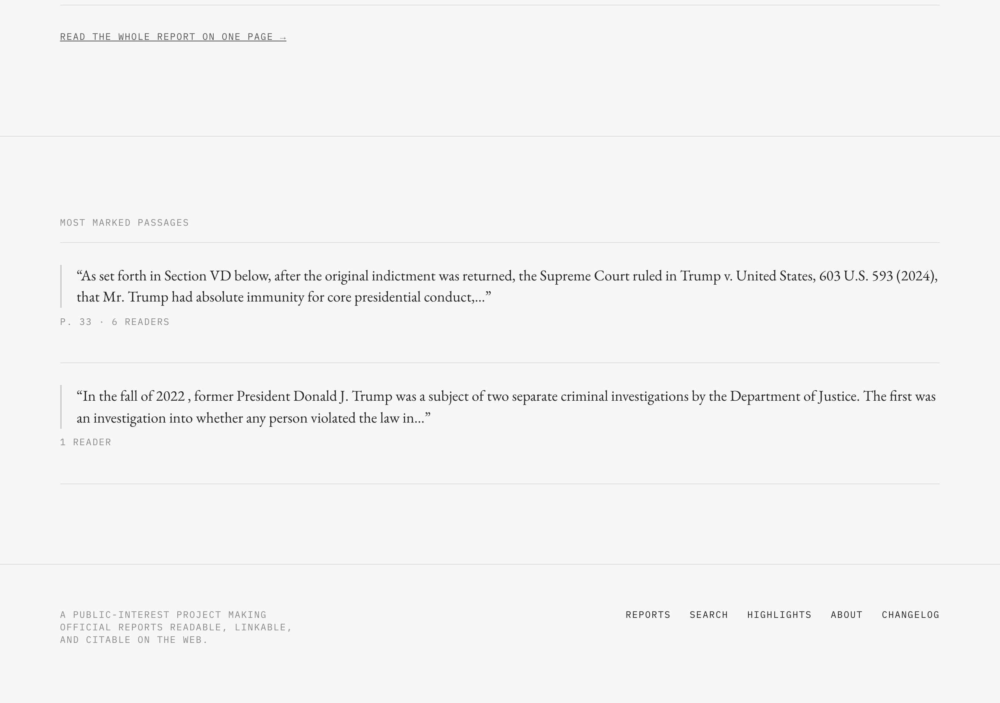

### Full-text search ([reportsthatmatter#100](https://github.com/reportsthatmatter/reportsthatmatter/issues/100))

Search spans every report, not just the one you're reading. A result is the
matched passage itself, with the term highlighted and the report, section,
and printed page it's on:

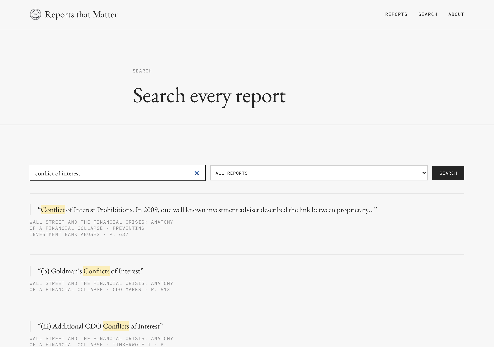

---

## 2026-08-28 — Leveson page-flow repair ([reportsthatmatter@f07a860](https://github.com/reportsthatmatter/reportsthatmatter/commit/f07a860))

On the *Operation Glade* page, a running header was rendered as prose and
ordinary continuation lines were mistaken for an indented quotation. The
ingest now respects the original volume boundaries, removes repeated page
furniture, and retains only genuine quotations.

**Before** — the header interrupts paragraph 2.1, while the continuation is
set as a quotation:

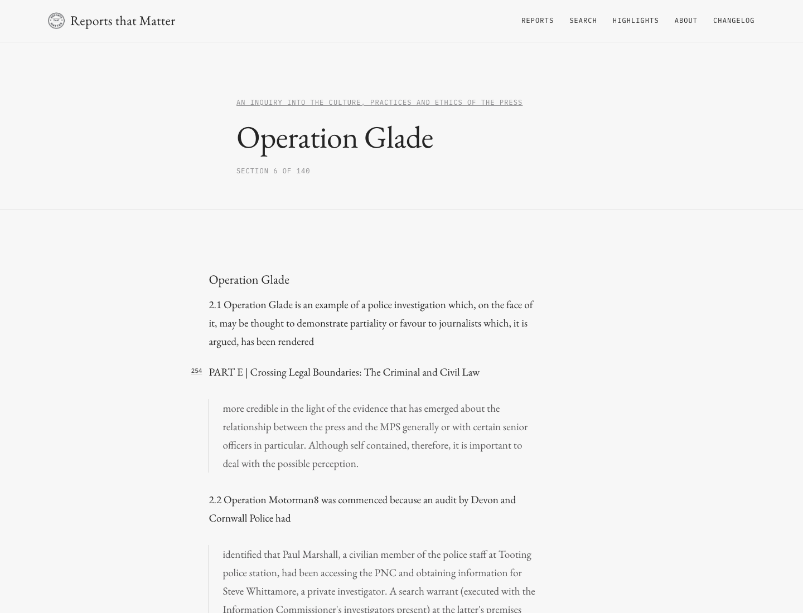

**After** — the paragraph reads continuously; page 254 remains a marker and
the following numbered paragraph also flows correctly:

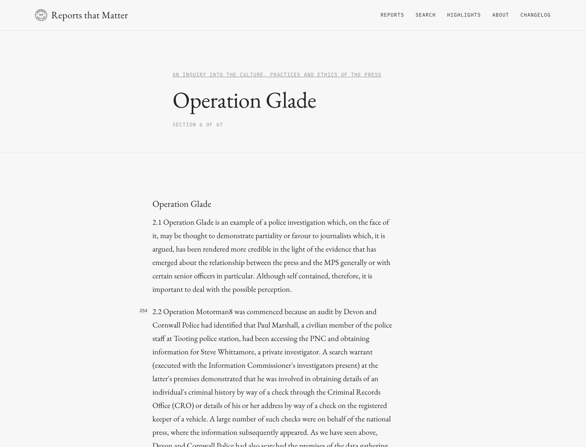

---

## 2026-08-29 — The Columbia report, and a two-column layout read three ways wrong

### Columbia Accident Investigation Board report ([reportsthatmatter#37](https://github.com/reportsthatmatter/reportsthatmatter/issues/37), [#101](https://github.com/reportsthatmatter/reportsthatmatter/issues/101))

The sixth report, and the first set in two columns. It had been ruled out a
year earlier for exactly that reason: `pdftotext -layout` puts both columns on
the same physical line, so reading line by line welds an unrelated sentence
into the middle of every paragraph. The fidelity checks never saw it — they
count words rather than order them.

Getting it right took four passes, and the first three shipped. Worth
recording, because each failure looked like success:

1. **Detection thresholds too strict.** A minimum gutter width of four
   characters and a blankness threshold near 1.0 missed 86 of 248 pages,
   including the executive summary. Columbia went live reading *"the February
   1, 2003, loss of the Space management across program elements"*.
2. **The column boundary was not a hard break.** Once split, the foot of the
   left column and the head of the right sat adjacent in the block stream, and
   the paragraph-continuation rule joined them back together.
3. **Justified text spills into the gutter.** A long word at the end of the
   left column reaches a character or two into the band, so those lines counted
   as full-width and were never split — welding the columns back on exactly
   the lines where the left column runs longest. The published summary read
   *"In the process, Columbiaʼs control over specifications and requirements,
   and waivers tragedy was compounded"*: three clauses from two columns in one
   sentence.

Each line is now split at its own run of whitespace nearest the gutter, and
the boundary between columns stops anything being joined across it.

**After** — the executive summary, reading in column order:

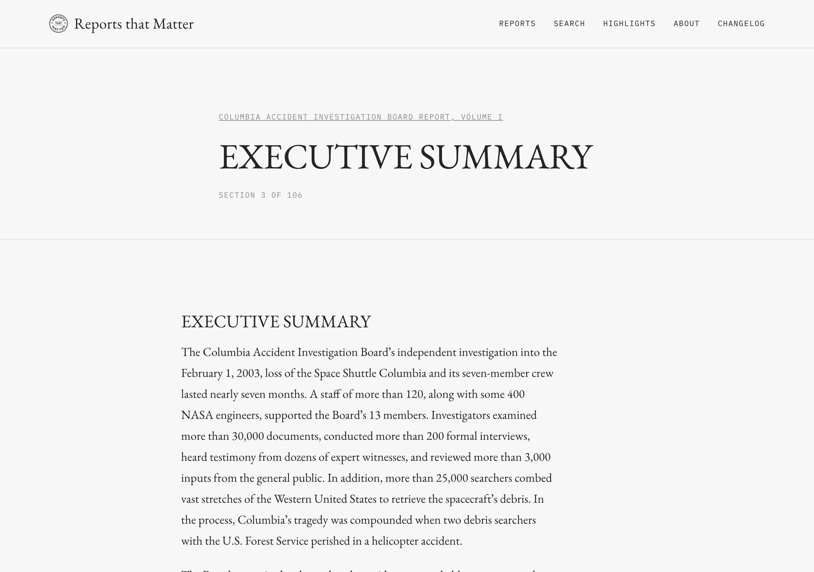

**The contents page**, 106 sections deep:

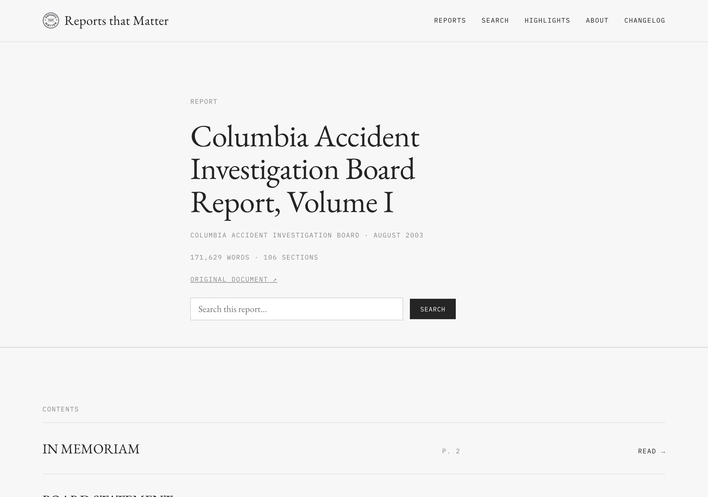

**The archive**, now six reports:

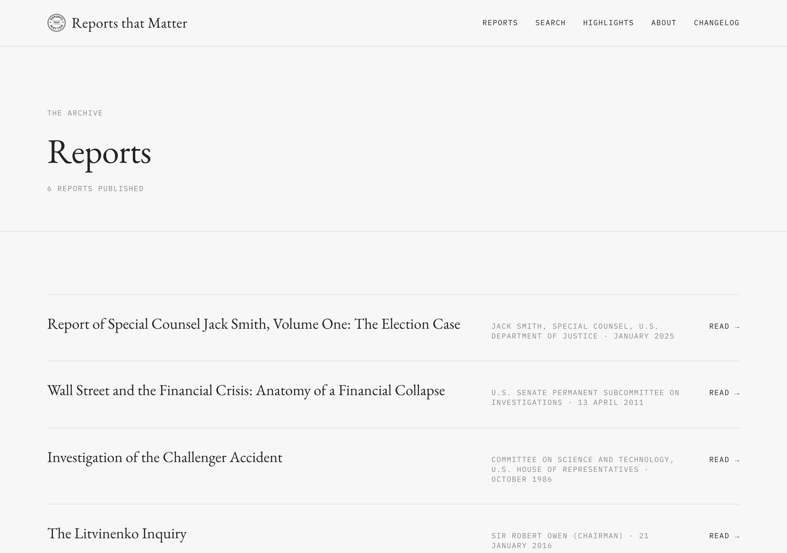

The lesson is the one already in `AGENTS.md` and worth restating: every
fidelity gate passed on all three broken versions. Only opening the published
page caught them.

